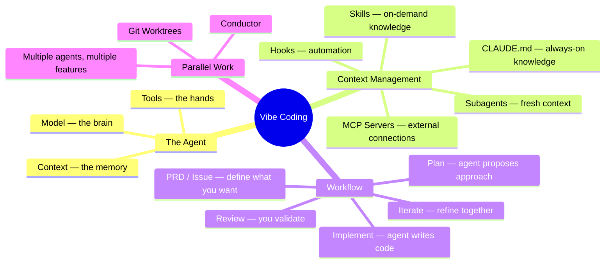

```mermaid
mindmap
  root((Vibe Coding))
    The Agent
      Model — the brain
      Tools — the hands
      Context — the memory
    Context Management
      CLAUDE.md — always-on knowledge
      Skills — on-demand knowledge
      Subagents — fresh context
      Hooks — automation
      MCP Servers — external connections
    Workflow
      PRD / Issue — define what you want
      Plan — agent proposes approach
      Implement — agent writes code
      Review — you validate
      Iterate — refine together
    Parallel Work
      Git Worktrees
      Conductor
      Multiple agents, multiple features
```
